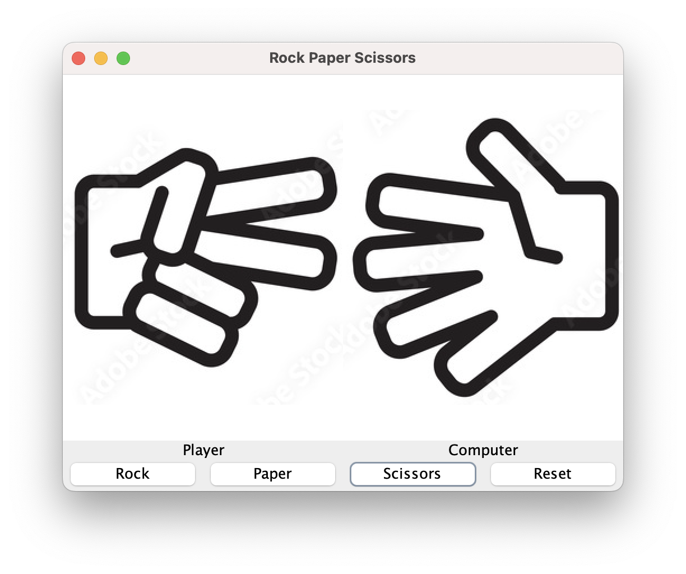

# Rock Paper Scissors With Buttons

## Sample Code

You've been provided with a working copy of the rock / paper / scissors project you completed earlier in the semester for reference. It should work fine, although it operates on text input. Run the code and review how it works. Note that the documentation (comments) is meant to help you see which code does what.

## Coding a Visual Rock / Paper / Scissors

In this project, you will use

- a frame
- multiple layouts
- multiple panels
- labels with icons
- buttons 
- an action listener
- an array
- randomizer
- the resource directory

## A Screenshot

Keeping an idea of what we're heading towards will help us.


## Create the Class

I named mine RPS and will work with that name going forward. I suggest you do the same. You've done this part multiple times.

## Imports

We'll use the following imports in this project. 
```
import javax.swing.*;
import java.awt.*;
import java.awt.event.ActionEvent;
import java.awt.event.ActionListener;
import java.util.Random;
```
None of these should be new to you!

## Included Files

Your repo will come with the image files `blank.png`, `leftpaper.png`, etc. saved in your `resource` folder. This is standard practice in Java - any files that are not Java code is saved in this folder. Unfortunately, reference to these files in any context is pretty arcane, but putting them in the resources folder makes it at least understandable.

The difficulty is caused by the nature of Java. In most languages, code is compiled by a compiler completely set up for the particular machine it's on (if this doesn't match your experience with video games, suffice to say I'm avoiding a lot of detail here). Java instead works with something called the "Java Virtual Machine" that makes the same code run on any platform. Consequently, as your code is compiled, a copy is made... somewhere. We have to trust the Virtual Machine to handle the location of resources in a consistent manner.

## Adding References to Your Files

Add the following code inside your class. This approach is meant to make later code a bit easier to follow. If you later choose to use different images for your project, you'll have all these references in one place.
```
    // collecting images here - if you change pictures, have them all in the resources folder
    ImageIcon BLANK = new ImageIcon(RPS.class.getClassLoader().getResource("blank.png"));
    ImageIcon LEFTROCK = new ImageIcon(RPS.class.getClassLoader().getResource("leftrock.png"));
    ImageIcon LEFTPAPER = new ImageIcon(RPS.class.getClassLoader().getResource("leftpaper.png"));
    ImageIcon LEFTSCISSORS = new ImageIcon(RPS.class.getClassLoader().getResource("leftscissors.png"));
    ImageIcon RIGHTROCK = new ImageIcon(RPS.class.getClassLoader().getResource("rightrock.png"));
    ImageIcon RIGHTPAPER = new ImageIcon(RPS.class.getClassLoader().getResource("rightpaper.png"));
    ImageIcon RIGHTSCISSORS = new ImageIcon(RPS.class.getClassLoader().getResource("rightscissors.png"));
```
If you view the images, you'll see that the left & right plays are facing one another to make it look more "real". Thus having names referring to left & right makes sense. These were all clipped from rockpaperscissors.jpg, which I found from a search on images.google.com.

The complicated code is worth understanding. RPS is the class we are currently working on. As such, any class will read out its path (where it is on your computer) by using ClassName.class.getClassLoader(). Since we want something in the resource directory, we add .getResource("imagefile.png"). We'll use this sort of approach again later.

This simplifies a lot of things. Look through your device and figure out where you saved your repo. Then do the same for the person to your left and the one to your right. Unless you're identical twins using identical devices and taking all the same classes, those were almost undoubtedly three different paths! Not to mention dealing with both Mac & Windows.

## Adding Fields

After the file names, add the following code.
```
private JLabel playerIconLabel;     // used for pictures
private JLabel computerIconLabel;

private JLabel playerLabel;         // used for labels
private JLabel computerLabel;

private JButton rockButton;         // play buttons
private JButton paperButton;
private JButton scissorsButton;

private JButton resetButton;        // clear plays
```
With the screenshot in mind, these should all make sense. We need them to be available to both the constructor and the listener for the buttons, so we declare them outside either.

## Make the Constructor

Don't bother having VSCode do this for you! The way you'll add it is sufficiently convoluted to make that pointless. This is because we want to make the interface look a particular way.

Start by adding a basic constructor.
```
public RPS() {
    setTitle("Rock Paper Scissors");
    setSize(500, 400);
    setDefaultCloseOperation(JFrame.EXIT_ON_CLOSE);
    setLocationRelativeTo(null);
    setLayout(new BorderLayout());

    setVisible(true);
}
```
You've seen this in past projects. We want to keep the visibility statement as the last of the constructor. All the constructor code will be inserted between the layout and visibility lines.

## Create `main` Method

In the class after the constructor but still inside the class, insert a main method. The only statement inside main should be `new RPS();`. All this will do is instantiate an object from the class. This is always necessary.

You should be able to test run your program at this point.

## Display Objects

Insert the following code into the constructor between the layout and visibility lines.
```
// Initialize labels with icons
playerIconLabel = new JLabel(BLANK);
playerIconLabel.setOpaque(true);

computerIconLabel = new JLabel(BLANK);
computerIconLabel.setOpaque(true);

// Initialize text labels
playerLabel = new JLabel("Player", SwingConstants.CENTER);
computerLabel = new JLabel("Computer", SwingConstants.CENTER);
```
The icon labels will display the pictures of rock, paper, or scissors, but are initially blank. The other labels help the player know which play is theirs. SwingConstants.CENTER is an option that tells the label to center its contents.

At this point, your code should compile, but won't do anything because we haven't added anything to the frame.

## Placing the Center Panel

These visual items could be added to the frame directly, but the display would look awful. In order to organize, we're going to make a center panel and add a left and right panel to it. Add the following code after the instantiation of the text labels but before the visibility line.
```
// Create center panel for labels
JPanel centerPanel = new JPanel();
centerPanel.setLayout(new GridLayout(1, 2));

JPanel leftPanel = new JPanel(new BorderLayout());
leftPanel.add(playerIconLabel,BorderLayout.CENTER);
leftPanel.add(playerLabel, BorderLayout.SOUTH);
centerPanel.add(leftPanel);

JPanel rightPanel = new JPanel(new BorderLayout());
rightPanel.add(computerIconLabel, BorderLayout.CENTER);
rightPanel.add(computerLabel, BorderLayout.SOUTH);
centerPanel.add(rightPanel);

// Add panel to frame
add(centerPanel, BorderLayout.CENTER);
```
Note centerPanel is really just a placeholder. It has one row and two columns - each space gets a panel of its own.

Then leftPanel gets a border layout so the icon label in the CENTER can be large while the label in the SOUTH will be relatively small. If we had used a grid layout for this panel, it would have made the two labels the same size, which wouldn't look very good. Both of these represent the player.

The rightPanel is identical, but represents the computer. Then both panels are added to centerPanel. And centerPanel gets added to the frame - notice the frame has no need for a name here, it's just the object we're adding things to.

At this point, you should be able to test run your code. It lacks buttons, of course, but it should give you a rough impression of how the finished product will look. You might change BLANK to LEFTROCK on them to see how those images will appear. Change them back after, though!

## Adding the Button Panel

Let's add the buttons to the frame before we actually make them function. Place this after the line that added centerPanel but before the visibility line.
```
// Initialize buttons
rockButton = new JButton("Rock");
paperButton = new JButton("Paper");
scissorsButton = new JButton("Scissors");
resetButton = new JButton("Reset");

// Create panel for buttons with 4x1 grid layout
JPanel buttonPanel = new JPanel();
buttonPanel.setLayout(new GridLayout(1, 4));

// Add the buttons
buttonPanel.add(rockButton);
buttonPanel.add(paperButton);
buttonPanel.add(scissorsButton);
buttonPanel.add(resetButton);

// Add panel to frame
add(buttonPanel, BorderLayout.SOUTH);
```
Hopefully the comments are self-explanatory. We're using a 4x1 grid so the buttons will line up along the bottom. We could probably have used FlowLayout as well, but when you resize a container with a flow layout, it can place things in a messy way.

At this point, you should test run your code. It should look pretty much like the screenshot. Again, if you want to see the other icons, make changes to the code, but change them back after.

## Creating the Listener

Between the constructor and the main method, add the following private class.
```
private class ButtonClickListener implements ActionListener {
    @Override
    public void actionPerformed(ActionEvent e) {
        // randomize computer choice
        ImageIcon[] computerChoices = {RIGHTROCK, RIGHTPAPER, RIGHTSCISSORS};
        Random random = new Random();
        ImageIcon computerChoice = computerChoices[random.nextInt(computerChoices.length)];
        
        if (e.getSource() == rockButton) {
            playerIconLabel.setIcon(LEFTROCK);
            computerIconLabel.setIcon(computerChoice);
        } else if (e.getSource() == paperButton) {
            playerIconLabel.setIcon(LEFTPAPER);
            computerIconLabel.setIcon(computerChoice);
        } else if (e.getSource() == scissorsButton) {
            playerIconLabel.setIcon(LEFTSCISSORS);
            computerIconLabel.setIcon(computerChoice);
        } else if (e.getSource() == resetButton) {
            playerIconLabel.setIcon(BLANK);
            computerIconLabel.setIcon(BLANK);
        }
    }
}
```
